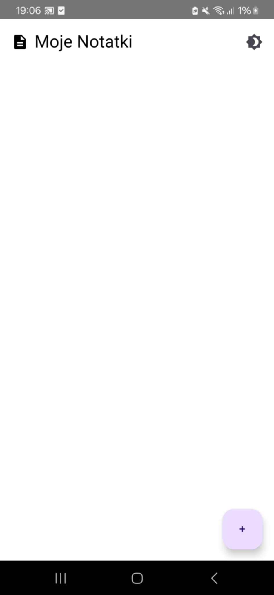
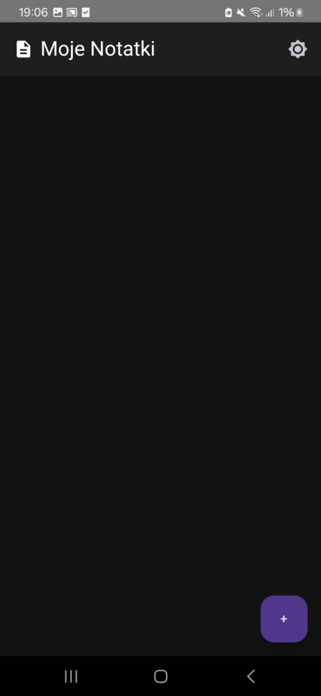
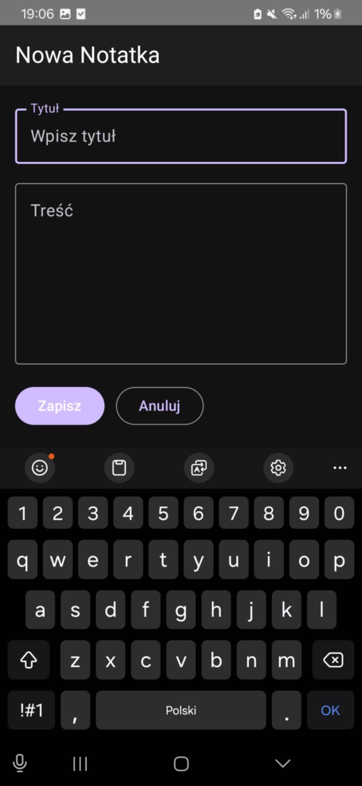
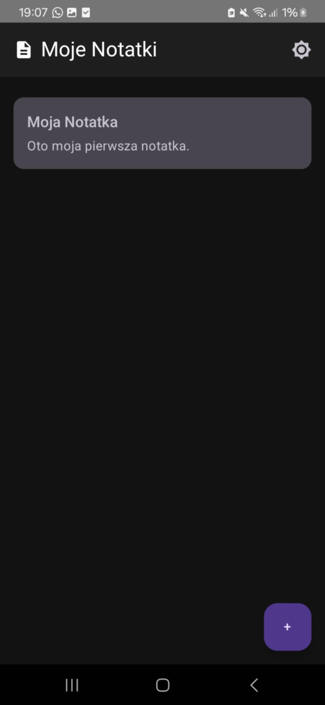
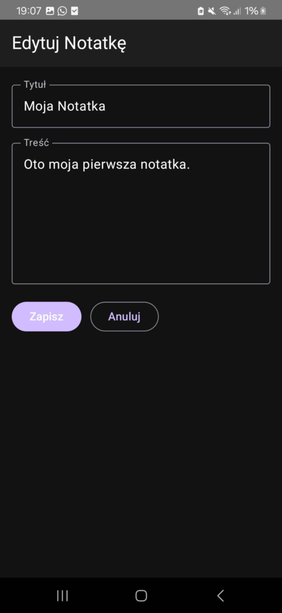

<h1 align="center"> Aplikacja Mobilna: Lista Zadań w Kotlin</h1>

Ten projekt to **prosta i funkcjonalna aplikacja mobilna do zarządzania listą zadań (TODO)**, stworzona w języku Kotlin z wykorzystaniem Android Studio. Pozwala użytkownikowi na dodawanie, usuwanie i oznaczanie zadań jako wykonane. Dane przechowywane są lokalnie za pomocą **Room Database**. Aplikacja została stworzona z wykorzystaniem wzorca architektonicznego **MVVM**, co zapewnia przejrzystość i łatwość w rozbudowie projektu.

---

##  Technologie i środowisko

- **Język:** Kotlin
- **Środowisko IDE:** Android Studio  
- **Running devices:** samsung SM-A346B •  
- **Biblioteki:**
  - Room – lokalna baza danych do przechowywania zadań
  - LiveData – obserwowalność zmian danych
  - ViewModel – logika biznesowa oddzielona od widoku
  - RecyclerView – efektywne renderowanie listy zadań
  - Material Components – stylizacja aplikacji
  - Navigation Component – zarządzanie nawigacją między ekranami

---

  
 Funkcje programu (kliknij, aby rozwinąć)

---

  
📄 <strong>MainActivity.kt</strong> – główna aktywność (kliknij, aby rozwinąć)

- Inicjalizuje całą aplikację Compose.
- Ustawia motyw (jasny/ciemny) z możliwością przełączania.
- Obsługuje nawigację pomiędzy ekranami listy i edycji notatek.
- Inicjalizuje bazę danych i ViewModel z repozytorium.
- Przykładowo usuwa wszystkie notatki przy starcie (do testów).

---

  
📄 <strong>Note.kt</strong> – model danych (kliknij, aby rozwinąć)

- Klasa danych reprezentująca notatkę.
- Oznaczona jako `@Entity` dla Room Database.
- Pola: `id`, `title`, `content`.

---

  
📄 <strong>NoteDao.kt</strong> – interfejs DAO (kliknij, aby rozwinąć)

- Udostępnia operacje na bazie danych:
  - `getAllNotes()`: zwraca wszystkie notatki jako `Flow<List<Note>>`
  - `getNoteById(id)`: pobiera notatkę po ID
  - `addNote(note)`: dodaje lub aktualizuje notatkę
  - `deleteNote(note)`: usuwa notatkę
  - `deleteAllNotes()`: usuwa wszystkie notatki

---

  
📄 <strong>NoteDatabase.kt</strong> – konfiguracja bazy danych (kliknij, aby rozwinąć)

- Tworzy bazę danych Room z encją `Note` i DAO `NoteDao`.
- Zawiera mechanizm singletonowy dla jednej instancji bazy.

---

  
📄 <strong>NoteRepository.kt</strong> – warstwa pośrednia (kliknij, aby rozwinąć)

- Oddziela logikę bazodanową od ViewModelu.
- Udostępnia metody `addNote`, `getNoteById`, `deleteNote`, `deleteAllNotes`.
- `notes`: przepływ wszystkich notatek jako `Flow<List<Note>>`.

---

  
📄 <strong>NoteViewModel.kt</strong> – logika widoku (kliknij, aby rozwinąć)

- Łączy repozytorium z interfejsem UI.
- Przechowuje i aktualizuje listę notatek oraz notatkę aktualnie edytowaną.
- Udostępnia metody: `addNote`, `updateNote`, `deleteNote`, `loadNote`, `clearCurrentNote`.

---

  
📄 <strong>AddEditNoteScreen.kt</strong> – ekran dodawania/edycji notatki (kliknij, aby rozwinąć)

- Dynamiczny ekran służący do dodawania lub edytowania notatki.
- Obsługuje wprowadzenie tytułu i treści notatki.
- Używa ViewModelu do załadowania notatki i zapisania zmian.
- Zawiera przyciski: „Zapisz” i „Anuluj”.

---

  
📄 <strong>NoteListScreen.kt</strong> – ekran listy notatek (kliknij, aby rozwinąć)

- Wyświetla listę wszystkich notatek.
- Umożliwia przejście do ekranu edycji po kliknięciu na notatkę.
- Zawiera przycisk do przełączenia motywu (jasny/ciemny).
- Posiada `FloatingActionButton` do dodawania nowych notatek.

---

  
📄 <strong>NoteCard.kt</strong> – komponent UI notatki (kliknij, aby rozwinąć)

- Komponent wyświetlający pojedynczą notatkę w formie karty.
- Umożliwia kliknięcie i przejście do edycji notatki.
- Styl oparty na Material3 z tytułem i treścią.

---

  
 Podgląd działania (kliknij, aby rozwinąć)

Poniżej przykładowe wyniki działania aplikacji:

  
  
  
  
  

